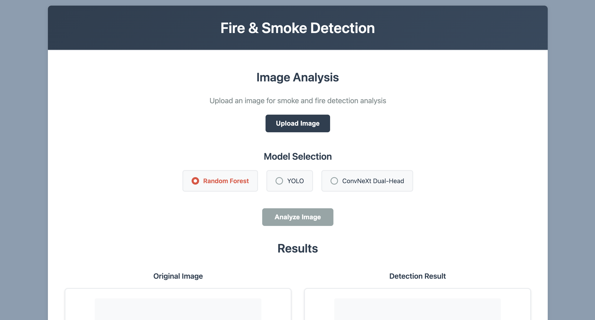
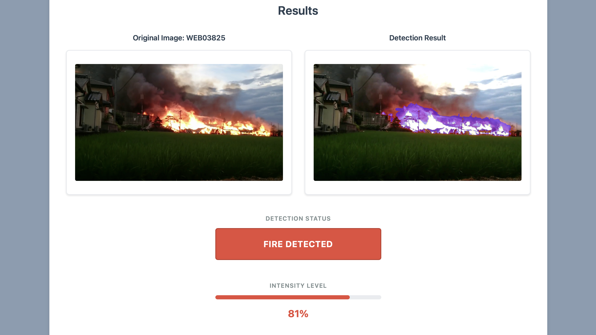
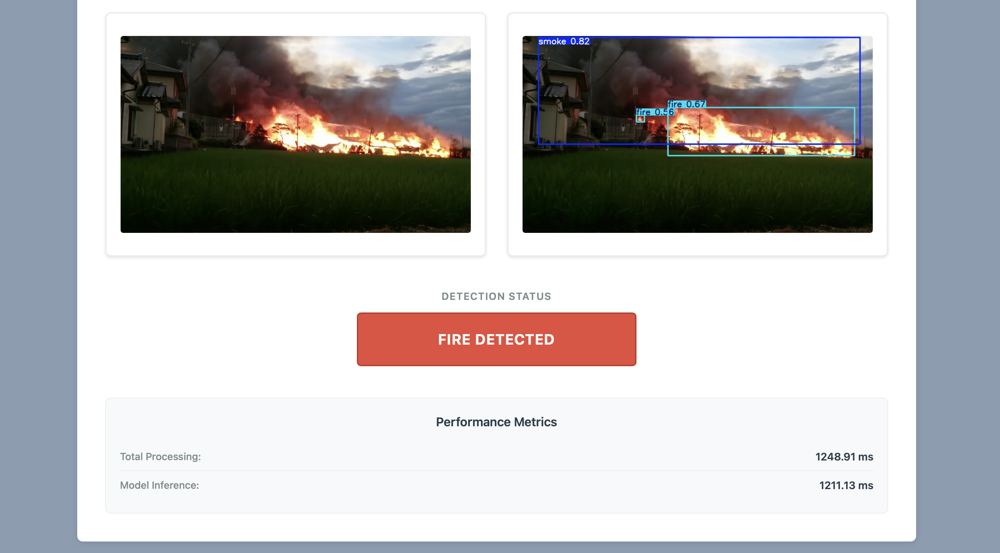
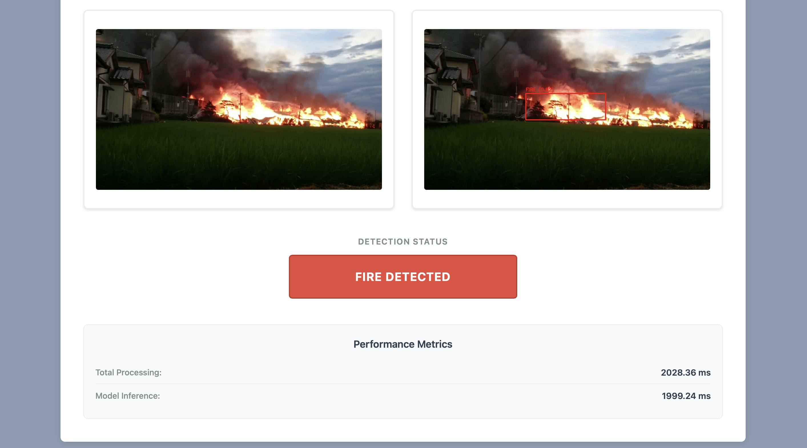

# Automatic Fire and Smoke Detection System
"Practical Machine Learning and Deep Learning" and "Introduction to Computer Vision" Course Project (Fall 2025)

Contributors: Lev Permiakov, Arina Petuhova, Aleliya Turushkina

## Project Overview
This project develops and compares three distinct models for the automatic detection of fire and smoke in images: a custom-built ConvNeXt-based Dual-Head neural network, a Texture-Analysis-based Random Forest classifier, and a YOLOv11 object detection model. The core objective is to evaluate the trade-offs between classification accuracy, localization precision, and computational efficiency for practical deployment.

## Repository Structure
```
├── .dvc/ # Directory for DVC (Data Version Control) metadata and tracking  
│
├── assets/ # Images for Demo
│
├── backend/ # Backend service for handles models inference and API logic  
│   ├── models/ # Folder with models and related helper scripts  
│   │   ├── convDualHead/ # ConvNeXt-based Dual-Head neural network 
│   │   ├── model_rf_structure/ # Random Forest model
│   │   └── yolo/ # YOLO
│   ├── app.py # Main backend application (Flask) 
│   ├── Dockerfile # Docker configuration for building backend container  
│   └── requirements.txt # Python dependencies
│   
├── data/ # Dataset-related files and notebooks  
│   └── data_clean.ipynb # Jupyter notebook for cleaning and labeling dataset  
│   └── eda.ipynb # Notebook for exploratory data analysis and visualization 
│   └── dataset.dvc # pointer file used by DVC to track dataset
│ 
├── frontend/ # Frontend for user interaction and visualization  
│   ├── index.html # Main HTML page (UI for uploading/testing fire detection)  
│   ├── script.js # JavaScript logic to handle API requests and results  
│   ├── styles.css # CSS file for styling the web interface  
│   └── Dockerfile # Docker configuration for building frontend container  
│
├── .dvcignore # Specifies which files/folders to exclude from DVC tracking  
├── .gitattributes # Git attributes configuration 
├── .gitignore # Files/folders excluded from Git
├── docker-compose.yml # Multi-container setup for backend + frontend  
├── LICENSE # MIT License file  
└── README.md # Main documentation for the project
```

## Technology Stack
- Programming Language: Python
- ML/DL Framework: PyTorch, Scikit-learn
- Libraries for data processing: OpenCV, NumPy, Pandas, SciPy, DVC
- Visualization and Analysis: Matplotlib, MLFlow
- Backend: Flask, Docker
- Frontend: HTML/CSS/JS, Docker

## Data
The project utilizes the D-Fire dataset, a comprehensive collection of over 21,000 images designed for fire and smoke detection. The dataset is categorized into images containing only fire (1,164), only smoke (5,867), both fire and smoke (4,658), and no threats (9,838). In total, it provides 14,692 bounding box annotations for fire and 11,865 for smoke. All annotations are provided in the YOLO format with normalized coordinates. 

[D-Fire  Dataset](https://www.kaggle.com/datasets/datascientist97/forest-fire)

[Exploratory Data Analysis](https://github.com/University-Projects-2025/Fire-Detection/blob/main/data/eda.ipynb)

## Getting Started
To set up and run the project locally:

1. Clone the repository:
    ```
    git clone https://github.com/University-Projects-2025/Fire-Detection.git
    ```
    
2. Navigate to the project directory:
    ```
    cd Fire-Detection
    ```

3. Build and start all the containers:
    ```
    docker-compose up --build
    ```

4. Go to the [http://localhost:8080](http://localhost:8080) to test the models

## Demo
These are some examples of how models work:







